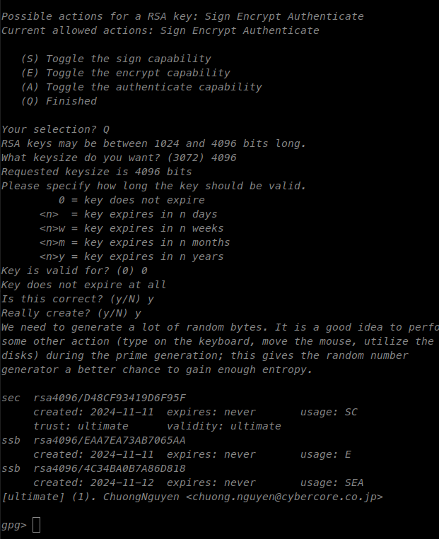

## I. Setup Environment for Yubikey:
<!-- - Install lib
```
sudo apt update
sudo apt -y upgrade
sudo apt -y install \
  wget gnupg2 gnupg-agent dirmngr \
  cryptsetup scdaemon pcscd libpcsclite-dev check gengetopt help2man \
  yubikey-personalization yubikey-manager yubico-piv-tool
ykman --version # Verify if the yubikey-manager is installed successfully

```

- Download and install the newest `yubico-piv-tools` https://developers.yubico.com/yubico-piv-tool/Releases/. At the time of writing, the newest version is `2.6.1`.
  - Compile the library by following the steps: https://developers.yubico.com/yubico-piv-tool/ 
  - Install Yubikey Manager: https://www.yubico.com/support/download/yubikey-manager/
  - Plug the Yubikey into your computer. -->

- Install `Yubikey-Manage`:
  ```
  sudo apt-add-repository ppa:yubico/stable
  sudo apt update
  sudo apt install yubikey-manager
  # verify ykman is installed successfully
  ❯ ykman --version
  # Expected Output: YubiKey Manager (ykman) version: 5.5.1
  ```
- Install `Yubico-piv-tool`:
  ```
  sudo apt update
  sudo apt -y install \
    cmake libtool libssl-dev pkg-config check libpcsclite-dev gengetopt help2man zlib1g-dev \
    wget gnupg2 gnupg-agent dirmngr \
    cryptsetup scdaemon pcscd  \
    yubikey-personalization yubico-piv-tool
  # Verfify Yubico-piv-tool is installed successfully
  ❯ yubico-piv-tool --version
  yubico-piv-tool 2.6.1
  ```
- A Yubikey has 3 types of PIN: 
  - OpenPGP PIN: used to unlock the OpenPGP application on the YubiKey. Its default user-pin is `123456` and its default admin-pin is `12345678`.
  - PIV PIN: used to unlock the PIV application on the YubiKey. Its default PIN is `123456` and its default PIN UnLock (PUK) is `12345678`.
  - FIDO2 PIN: used to unlock the FIDO2 application on the YubiKey. It does not have a default PIN.
  - We should use the default PIN for the first time setup to avoid confusing. After finish all settings, we can change the PIN to a more secure one (Step III).
  - For the first time user, we may not get the correct PIN and the Yubikey will be locked after 3 fail trials. In this case, we need to use the admin-pin to unlock it. To reduce the risk, change the number of trials to 20 or more.
  ```
  ykman openpgp access set-retries 20 20 20 #
  ykman piv access set-retries 20 20
  ```
  - If you can't remember the PIN, you can reset the Yubikey by:
  ```
  ykman openpgp reset # reset OpenPGP will delete all OpenPGP data
  ykman piv reset # reset PIV will delete all PIV data
  ```
  For example:
  ```
  > ykman piv reset
  WARNING! This will delete all stored PIV data and restore factory settings. Proceed? [y/N]: y
  Resetting PIV data...
  Reset complete. All PIV data has been cleared from the YubiKey.
  Your YubiKey now has the default PIN, PUK and Management Key:
    PIN:    123456
    PUK:    12345678
    Management Key: 010203040506070801020304050607080102030405060708
  ```

## II. Setup PGP key on Yubikey:
In this section, we follow the tutorial: https://support.yubico.com/hc/en-us/articles/360013790259-Using-Your-YubiKey-with-OpenPGP to install required library and the following steps:

### 1. Create Key:
Enter command: `gpg --expert --full-gen-key` and follow the instruction to generate a key.
- We use Yubikey 5, so enter `4096` for  RSA key size.
- Choose `0=key does not expire.`
- It will ask for your name, your email and a passphrase for the key. **You must remember the passphrase to do the next steps.**
- While the key is being generated, move your mouse around or type on the keyboard to gain enough randomness for the key.
- Record `key-ID` to use later in step II, such as follows:
    
    

- if you lost the `key-ID` (but you must remember the passphrase to continue),  it is the last 16 digits of the `sec` output when command:
  ```
  gpg --list-secret-keys 
  ```

### 2. Add Authenticate key:
Add Authenticate key by following command:
- `gpg --expert --edit-key <key-ID>` to enter the key editing mode and follow the steps:
- It will ask for your passphrase that you set in the Step 1 to continue.
<div style="display: flex;">
  
  
</div>

### 3. Backup the key:
- `gpg --export-secret-keys --armor <key-ID>` to export the key in ASCII format. It will ask for your passphrase to continue.
- Save the key output to a text file and save it to a safe place.

### 4. Move the keys to Yubikey:
- Follow `To import the key on your YubiKey:` section in the tutorial `https://support.yubico.com/hc/en-us/articles/360013790259-Using-Your-YubiKey-with-OpenPGP`
- `gpg --edit-key <key-ID>` to enter the key editing mode. 
- enter `keytocard` and follow the steps:
  - It will ask for your passphrase and admin-PIN to continue. The default admin-pin is `12345678`.
  - Choose the key type to move to Yubikey. You will need to do it 2 times, one for each key type: 1. Signing and Encryption, 3. Authentication.
- enter `quit` when finish.
- When prompted to save your changes, enter n (no). Otherwise, GPG will delete you key from your hard drive, and you won't be able to copy it to another YubiKey/keep it as a backup/etc. See here for a more detailed explanation.

### 5. Verify the key is on Yubikey:
- `gpg --card-status` to verify the key is on Yubikey, you should see your key info in the line `General key info..:`. 

## III. Setup Wireguard Key as PIV:
### 1. Background
The wireguard config, for example: `dc-morioka.conf` is given to the user `chuong` in the following format:

```
[Interface]
PrivateKey = ABCDEF_a_private_key_that_we_want_to_encrypt_and_store_on_the_yubikey=
Address = 192.168.121.25/24

[Peer]
PublicKey = LMNOPQ_a_public_key_that_public_access=
PresharedKey = RHKTMN_a_sharekey_key_that_we_want_to_encrypt_and_store_on_the_yubikey=
AllowedIPs = 192.168.120.0/24
Endpoint = labo.cybercore.co.jp:51820
```

- The user saved the config file to `/etc/wireguard/dc-morioka.conf`. 
- To use the wireguard, the user need to run these commands:
```
sudo systemctl enable wg-quick@dc-morioka
sudo systemctl start wg-quick@dc-morioka
sudo systemctl status wg-quick@dc-morioka
```

### 2. Secure Wireguard Key into Yubikey
To protect the config file from unauthorized copy, we will encrypt the private key and Preshared Key to into Yubikey PIV slots. A Yubikey has 65000 slots for PIV.
- we follow the tutorial: https://www.procustodibus.com/blog/2023/02/wireguard-yubikey/ in the steps PIV SLOT:
1. Remove the PrivateKey and PreshareKey from the config file, copy it to a separate file, for example: `dc-morioka_private.key` and `dc-morioka_preshared.key`. **Each key file is a single line.**
```
> cat dc-morioka_private.key
ABCDEF_a_private_key_that_we_want_to_encrypt_and_store_on_the_yubikey=
``` 
2. Encrypt and store the keys to PIV slots:
```
gpg --encrypt --recipient <key-ID>  dc-morioka_private.key
gpg --encrypt --recipient <key-ID>  dc-morioka_preshared.key
```
where `<key-ID>` is the key ID of the GPG key that you created in the step II.1. This will create the encrypt key file `dc-morioka_private.key.gpg` and `dc-morioka_preshared.key.gpg` in the same directory.

3. Store the encrypted key to Yubikey PIV slot:
```
ykman piv objects import 5f0000 dc-morioka_private.key.gpg
ykman piv objects import 5f0001 dc-morioka_preshared.key.gpg
```
where `5f0000` and `5f0001` are the PIV slots number. You can choose any slot number you want, from `5f0000` to `5fffff`.

Now the keys are stored in the Yubikey PIV slot and can't not be copied. If you want to read it and confirm it matched with the key, you can use
```
ykman piv objects export 5f0000 - | gpg --decrypt
```
but it will ask for the passphrase to decrypt the key. So, if the person does not know the passphrase, they can't read the key.

4. Delete the original key file:
```
ls *.key*
rm dc-morioka_private.key*
rm dc-morioka_preshared.key*
```

5. Modify the config file to use the Yubikey PIV slot:


```
[Interface]
PostUp = wg set dc-morioka private-key <(ykman piv objects export 5f0000 - | sudo -u chuong gpg -d)
PostUp = wg set dc-morioka peer ga76P+hZ1ihKhU8YZUVN8IPRhsRBe4uKEK0KkuubX10= preshared-key <(ykman piv objects export 5f0001 - | sudo -u chuong gpg -d)
Address = 192.168.109.56/24

[Peer]
PublicKey = ga76P+hZ1ihKhU8YZUVN8IPRhsRBe4uKEK0KkuubX10=
AllowedIPs = 192.168.109.0/24, 192.168.110.0/24
Endpoint = dc-morioka.cybercore.co.jp:51820
PersistentKeepAlive = 30
```
Note that, 
- The PIV SLOT must match with the SLOT when you import keys to Yubikey. In the example above, they are `5f0000` and `5f0001`.
- The user `chuong` is the sudo user that will run the Wireguard command. Change it to your user.
- in the PostUp for preshared-key, we copy the Public key of [Peer] to the config file. In the example above, it is `ga76P+hZ1ihKhU8YZUVN8IPRhsRBe4uKEK0KkuubX10=`.

6. Stop and restart the Wireguard service:
```
sudo systemctl stop wg-quick@dc-morioka.service
sudo systemctl start wg-quick@dc-morioka.service
sudo systemctl status wg-quick@dc-morioka.service
```

## IV. Secure SSH & GitHub with Yubikey:
- We follow this tutorial `https://developers.yubico.com/PIV/Guides/SSH_with_PIV_and_PKCS11.html` to configure SSH and GitHub with Yubikey.
- The examples given in the following steps assume that you have not yet changed the management key. If you have changed the management key, add `--key` to all the `yubico-piv-tool` command below. 
1. Create `public.pem`
```
> cd ~/.ssh
yubico-piv-tool -s 9a -a generate -o public.pem
```
- where `9a` is the PIV slot number. You can choose any slot (possible
  values="9a", "9c", "9d", "9e", "82", "83", "84", "85", "86", "87", "88", "89", "8a", "8b", "8c", "8d", "8e", "8f", "90", "91", "92", "93", "94", "95", "f9"). Type `yubico-piv-tool --help` to see the help.
- this will create a public key file `public.pem` in the current directory.

2. Create a self-signed certificate for that key
```
yubico-piv-tool -a verify-pin -a selfsign-certificate -s 9a -S "/CN=SSH key/" -i public.pem -o cert.pem
```
- it will ask for PIN to create the certificate.
- this will create a self-signed certificate `cert.pem` in the current directory.

3. Load the certificate
```
yubico-piv-tool -a import-certificate -s 9a -i cert.pem
```
- this will load the certificate into the Yubikey.

4. Export the public key in correct format for SSH and then add it to authorized_keys on the target system.
```
ssh-keygen -D /usr/local/lib/libykcs11.so -e # For Linux
ssh-keygen -D /usr/local/lib/libykcs11.dylib/libykcs11.so -e # For MAC
```
- this will print the public key, one for PIV Authentication and one for PIV Attestation. Copy PIV Authentication to the target system, for example GitHub. 

5. Setup SSH agent:
```
> ssh-add -s /usr/local/lib/libykcs11.so
Enter passphrase for PKCS#11: 
Card added: /usr/local/lib/libykcs11.so
```
- it will ask for passphrase for PKCS#11. Enter PIV PIN (default 123456), do not confuse with the passphrase you created in Step II.1
- if you get error `Could not add card "/usr/local/lib/libykcs11.so": agent refused operation`, then do `eval ssh-agent` and try again.
- Confirm that the ssh-agent finds the correct key and gets the public key in the correct format by running:
```
ssh-add -L
```

## III. Change default PIN Yubikey:
Before giving the Yubikey to the user, the Admin must change the default PIN.
1. Change OpenPGP PIN: 
  - You can check the options by running `ykman openpgp access --help`.
  - Run `ykman openpgp access change-pin`. The default `user-pin` is `123456`.
  - Run `ykman openpgp access change-admin-pin`. The default `admin-pin` is `12345678`. 
  - Run `ykman openpgp access change-reset-code` to change reset code. You will need admin-pin to change reset code.
  - RUn `ykman openpgp access set-retries 5 5 5` to set the number of retries for PIN, Reset Code, and Admin PIN back to 5 times.

2. Change PIV PIN:
  - You can check the options by running `ykman piv access --help`.
  - Run `ykman piv access change-pin`. The default `user-pin` is `123456`.
  - Run `ykman piv access change-puk`. The default `puk` is `12345678`. THis key is used to unlock the PIN if user fails after 3 times and the PIN is locked.
  - Run `ykman piv access change-management-key`. The default `management-key` is `010203040506070801020304050607080102030405060708`.
  - Run `ykman piv access set-retries 5 5` to set the number of retries for PIN and PUK to 5 times.
